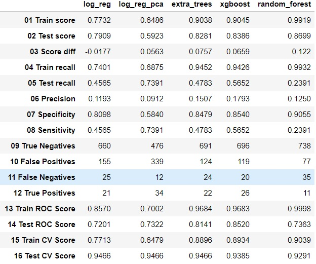

# Project 4: West Nile Virus
---

## Problem Statement
---
There has been recent epidemic of West Nile Virus in Chicago. West Nile virus is most commonly spread to humans through infected mosquitos. Around 20% of people who become infected with the virus develop symptoms ranging from a persistent fever, to serious neurological illnesses that can result in death. In 2002, the first human cases of West Nile virus were reported in Chicago. By 2004 the City of Chicago and the Chicago Department of Public Health (CDPH) had established a comprehensive surveillance and control program that is still in effect today. Every week from late spring through the fall, mosquitos in traps across the city are tested for the virus. 

We are a team from the Disease And Treatment Agency, division of Societal Cures In Epidemiology and New Creative Engineering (DATA-SCIENCE). To control the spread of the virus, we have been tasked to study the data that has been collected over time and use the data to build a model and make predictions that the city of Chicago can use when it decides where to spray pesticides. A more accurate method of predicting outbreaks of West Nile virus in mosquitos will help the City of Chicago and CPHD more efficiently and effectively allocate resources towards preventing transmission of this potentially deadly virus. We will evaluate our model based on precision and AUC score.

Spraying pesticides are a necessary action in the fight for public health and safety, however it is extremely costly. To determine the effectively of our model, we will be conducting a cost-benefit analysis. This will include annual cost projections for various levels of pesticide coverage (cost) and the effect of these various levels of pesticide coverage (benefit). 

## Executive Summary
---
We started off by analyzing the four sets of data provided: train, test, weather, and spray data. The train data is the most important dataset as it contains information and results of monitoring various traps and recorded if the WNV is present or not. This data spans the years 2007, 2009, 2011 and 2013. The test data has the same features across the years 2008, 2010, 2012 and 2014. However, it does not contains the data for number of mosquitoes captured in each trap and if West Nile virus (WNV) is present. The weather dataset contains weather information for all the years between 2007 and 2013 collected from two weather stations. The spray dataset contains the locations of those regions where pesticide was applied. The data is only available for 2011 and 2013 with a total of 10 days.


The datasets were then cleaned and we filled the missing data with meaningful values. We merged the weather data to the train and test data based on date and weather station assigned to each trap by calculating the distance from trap. One hot encoding was applied to categorial features like the trap number, codesum and the types of mosquitoes caught in the traps. We also removed features with multicollinearity. Another important feature engineering that we have done is to lag the weather data by one week. This is due to the fact that the entire life cycle of the mosquito, from an egg to an adult, takes approximately 8 to 10 days and pupae develop into adult flying mosquitoes in 2 to 3 days. Using weather data that is lagged by a week will hence be more appropriate to give us a better prediction.


The train data has a highly imbalanced class where the majority class (about 95%) shows data for which WNV was not present while only about 5% of the data shows that WNV was present. We applied Synthetic Minority Over-sampling Technique (SMOTE) to oversample the minority class before using the data on our models. We then constructed five different models: Logistic regression, logistic regression with PCA, Extra trees, XGBoost and Random Forest.


To determine the overall performance of our model, we wish to reduce the number of false positives as these are the instances whereby a particular trap is predicted to have WNV presence while in actual fact, it is not. This can lead to spraying a non-infected area and result in spending extra cost on the pesticide which is highly ineffective. We are interested in a model with high precision rate: when it predicts WNV presence at a trap, it is correct most of the time. Another parameter that we are concerned with is AUC. AUC represents degree or measure of separability. It tells how much model is capable of distinguishing between the classes. The higher the AUC, the better the model is at making the right predictions. 

Results from the 5 models are shown in the table below:


Based on the the results, we concluded that the XGBoost model has the best performance based on its high precision and AUC score on the test data. The top five features are 'loc', 'sunrise', 'resultspeeed', 'depart' and 'tmax_wk1'.


#### Data Dictionary for merged_df

|Column Name|Data type| Description|
|:--|:--|:--|
|date|datetime64|Date that the WNV test is performed in 2007, 2009, 2011, 2013|
|address|object|Approximate address of the location of trap. This is used to send to the GeoCoder|
|species| object|6 Species of CULEX mosquitos|   
|block |int64|Block number of address|     
|street|object|Street name|
|trap|object|Id of the trap|
|addressnumberandstreet|object|Approximate address returned from GeoCoder|       
|latitude|float64|Latitude returned from GeoCoder|       
|longitude|float64|Longitude returned from GeoCoder|       
|addressaccuracy|int64 |Accuracy returned from GeoCoder|        
|wnvpresent|int64|Whether West Nile Virus was present in these mosquitos. 1 : WNV is present, 0 : not present.|       
|nummosquitos|int64|number of mosquitoes caught in a particular trap|         
|year|int64|year|         
|month|int64  |month|       
|day|int64|day|         
|station|float64|nearest weather station|       
|stn_distance|float64|distance to the nearest weather station|
|tmax|int64|Maximum temperature in Degrees Fahrenheit|         
|tmin|int64|Minimum temperature in Degrees Fahrenheit|         
|tavg|float64|Average temperature in Degrees Fahrenheit|       
|depart|float64|Departure from normal|       
|dewpoint|int64|Average dew point|         
|wetbulb|float64|Average wet bulb|       
|heat|float64|Heating (Season begins with Jul)|       
|cool|float64|Cooling (Season begins with Jan)|
|sunrise|float64|Sunrise (calculated)|       
|sunset |float64|Sunset (calculated)|       
|codesum|object|Weather Phenomena|        
|preciptotal|float64|Precipitation|       
|stnpressure| float64 |Average station pressure| 
|sealevel|float64 |Average sea level pressure|      
|resultspeed|float64|Resultant Wind Speed|       
|resultdir|int64 |Resultant Wind Direction|        
|avgspeed|float64|Average speed| 
|tmax_wk1|int64|tmax lag by a week|         
|tmin_wk1|int64|tmin lag by a week|         
|tavg_wk1|float64|tavg lag by a week|              
|dewpoint_wk1|int64|dewpoint lag by a week|         
|wetbulb_wk1|float64|wetbulb lag by a week|       
|heat_wk1|float64|heat lag by a week|       
|cool_wk1|float64|cool lag by a week|       
|preciptotal_wk1|float64|preciptotal lag by a week| 
|cs_fg|int64 |one hot encoded codesum for FG|        
|cs_vcts|int64|one hot encoded codesum for VCTS|         
|cs_tsra|int64|one hot encoded codesum for TSRA|         
|cs_br|int64|one hot encoded codesum for BR|         
|cs_hz|int64|one hot encoded codesum for HZ|         
|cs_ts|int64|one hot encoded codesum for TS|         
|cs_na|int64|one hot encoded codesum for NA|         
|cs_dz|int64|one hot encoded codesum for DZ|         
|cs_ra|int64|one hot encoded codesum for RA|
|s_cpr|int64|one hot encoded species for CULEX PIPIENS/RESTUANS|   
|s_cp|int64|one hot encoded species for CULEX RESTUANS|   
|s_cr|int64|one hot encoded species for CULEX PIPIENS|               
|loc|float64 |interaction term of latitude and longtitudes|      


---
### Files used in this project
```bash
|-- README.md
|-- DSI16-P4G4.pdf
|-- code
|   |-- project4_WNV.ipynb
|-- assets
|   |-- merged.csv
|   |-- sampleSubmission.csv
|   |-- spray.csv
|   |-- submission.csv
|   |-- test.csv
|   |-- train.csv
|   |-- weather.csv
|   |-- mapdata_copyright_openstreetmap_contributors.rds
|   |-- mapdata_copyright_openstreetmap_contributors.txt
|   |-- noaa_weather_qclcd_documentation.pdf
|   |-- kaggle.jpg
|   |-- results.jpg
|   |--Boundaries_cities
|       |-- geo_export_095d1d3d-b302-4bae-8a12-f6f48cb71b9f.dbf
|       |-- geo_export_095d1d3d-b302-4bae-8a12-f6f48cb71b9f.prj
|       |-- geo_export_095d1d3d-b302-4bae-8a12-f6f48cb71b9f.shp
|       |-- geo_export_095d1d3d-b302-4bae-8a12-f6f48cb71b9f.shx
```
---
